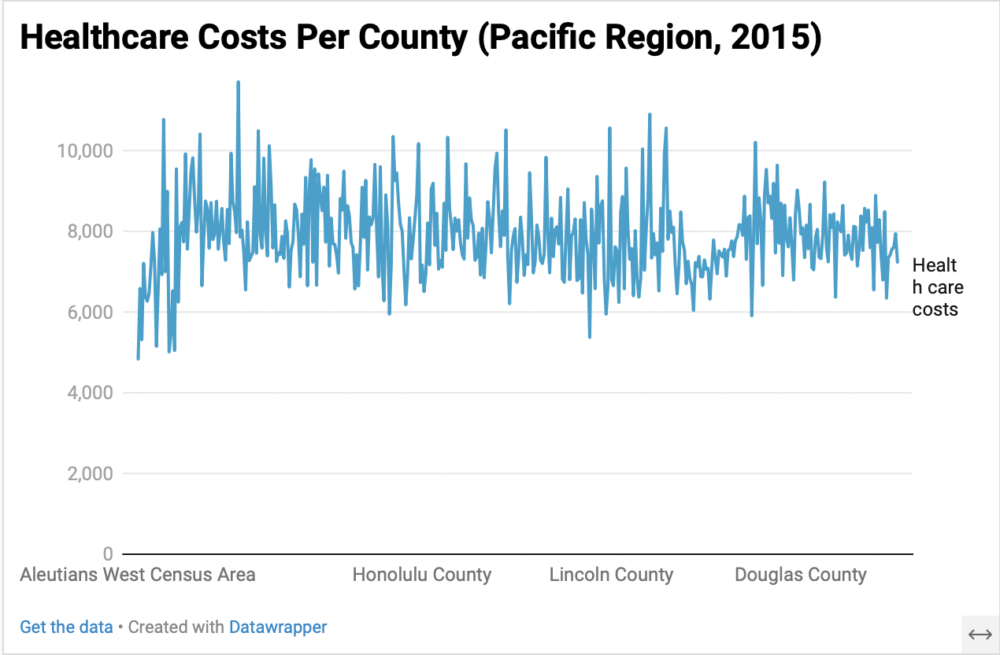

# County Health Data 2014-2015

## Source Data

The data used in this repository was sourced from various public health agencies and organizations. Specifically, the County Health Data 2014-2015 includes health-related data for U.S. counties during the specified time period.

## Repository Data

This repository aims to provide a concise and informative presentation of health data from 2014-2015:

- Provides comparisons between different health indicators across various counties.
- Presents information objectively to allow viewers to draw their own conclusions.
- Designed to be understandable to the general public without requiring specific background knowledge.
- Relevant to individuals interested in public health and healthcare analysis.

## Prospective Users

Ideally, users should be able to examine the compiled health data in this repository and derive their own insights about the health status of different counties in 2014-2015. By condensing the data, this repository facilitates easier analysis and interpretation compared to using the original raw datasets.

### Available Data:

- Primary Care Provision-2014-2015
- Mental Health Provision-2014-2015
- Disease Incidence-2014-2015

## How to Get Started

To explore the County Health Data 2014-2015:

1. Clone the repository to your local machine.
2. Navigate to the `data` folder to access the datasets.
3. Refer to the README file for additional context and insights.
4. Use the provided visualization to understand trends and patterns in the data.

